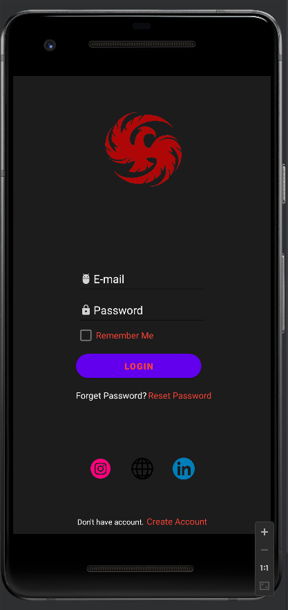

# LoginScreenApp

This application is developed by Tolga KALAYCIOĞLU for SENG-405 Lesson. 

Student Number: 201711040

This application simulates a Login Screen Design. It was implemented on Android Studio in Java Programming Language. 

It includes email and password validation.

__Download APK__ -> [LoginScreenApp](https://github.com/tolgak99/LoginScreenApp/blob/master/images/app-debug.apk?raw=true)

